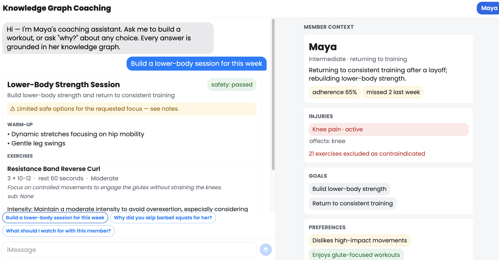

# Knowledge Graph Coaching Platform

An AI coaching assistant that ingests a member's context into a **Neo4j knowledge
graph**, retrieves the safety-relevant slice via **GraphRAG** (vector search +
graph traversal), and generates **injury-aware, explainable** workout
recommendations a coach can interrogate ("why?").

The differentiator is **reasoning over relationships, not just semantic search**:
safety is computed deterministically in the graph (never by the LLM), and every
recommendation carries a graph trace that answers "why?" without re-prompting.

A coach can:

| Ask | What happens |
| --- | --- |
| "Build a lower-body session for this week." | Generates a workout that respects injuries, equipment, goals, and recent history — knee-loading exercises never appear. |
| "Why did you skip barbell squats?" | Explains via graph relationships: `Member → has injury → Knee pain → affects joint → knee ← loads joint ← Exercise`. |
| "What should I watch for?" | Surfaces adherence trend, flagged injuries, stated goals, recent signals. |



---

## 1. Project overview

- **Backend:** Python + FastAPI, LangGraph orchestration, Neo4j (graph + native
  vector index), OpenAI (LLM + embeddings) behind thin adapters.
- **Frontend:** Expo / React Native Web (served as static assets).
- **Demo data:** one strong synthetic member, **Maya** (knee injury, limited
  equipment) — depth over breadth.
- **One command:** `docker compose up --build` brings up Neo4j, seeds the graph,
  starts the API, and serves the web UI.

## 2. Architecture

```
Frontend (Expo / RN Web)  ──HTTP/JSON──>  API (FastAPI, typed schemas)
                                              │
                              Orchestration (LangGraph StateGraph)
                              retrieve → generate → validate → explain
            ┌───────────────┬──────────────┬───────────────┐
            ▼               ▼              ▼               ▼
        Retriever       LLM client     Safety          Explanation
      vector+graph     (OpenAI)       validator        builder
      + graph_trace                  (deterministic)  (reads trace)
            │
            ▼
        Neo4j  (nodes · edges · vector index)
```

Key principles (see [`ARCHITECTURE.md`](ARCHITECTURE.md)):

- **The graph does real work** — safety, retrieval scope, and explanations derive
  from explicit relationships.
- **Safety is deterministic, not LLM-judged** — injury filtering is Cypher over the
  graph; the LLM is never the only safety layer.
- **Fixed data flow** — `retrieve → generate → validate → explain`; validation runs
  after generation and before the response leaves the API.
- **Explanations read the recorded `graph_trace`** — no re-querying or rationalizing.

Module layout: `backend/app/{api,graph,ingestion,retrieval,generation,safety,explain,orchestration,llm,observability}`.

## 3. Local setup

**Prerequisites:** Docker + Docker Compose. (For local dev without Docker: Python
3.11+, Node 22+.)

```bash
cp .env.example .env
# Edit .env and set OPENAI_API_KEY=sk-...   (REQUIRED — see Synthetic data / Tradeoffs)
```

> **OpenAI key is required.** Embeddings and generation are OpenAI-only (no local
> fallback). Without a key the graph still seeds, but retrieval/generation won't work.

## 4. How to run

```bash
docker compose up --build
```

This starts four services and seeds the graph on first boot:

- **neo4j** — graph + vector index (Browser at http://localhost:7474)
- **seed** — one-shot: schema + exercises + Maya + embeddings, then exits
- **api** — FastAPI at http://localhost:8000 (OpenAPI docs at `/docs`)
- **frontend** — web UI at **http://localhost:8081**

Open **http://localhost:8081**, select Maya, ask "Build a lower-body session for
this week", view the workout + safety result, then ask "why?".

**Local dev (no Docker):**

```bash
# Neo4j only
docker compose up -d neo4j
cd backend && python -m venv .venv && ./.venv/bin/pip install -r requirements.txt
export OPENAI_API_KEY=sk-...    # plus NEO4J_URI=bolt://localhost:7687
./.venv/bin/python -m app.seed                       # seed the graph
./.venv/bin/uvicorn app.main:app --reload            # API on :8000
# Frontend
cd ../frontend && npm install && npm run web          # web on :8081
```

## 5. How to run tests

Two critical-path tests (require Neo4j running; no OpenAI key needed):

```bash
docker compose up -d neo4j
cd backend && PYTHONPATH=. NEO4J_URI=bolt://localhost:7687 ./.venv/bin/pytest tests/ -v
```

- **`test_injury_filtering.py`** — the contraindicated set equals the knee-loading
  set exactly; the validator rejects a workout containing a contraindicated exercise
  and repair removes it. *Chosen because injury filtering is the core safety promise.*
- **`test_graph_retrieval.py`** — the `Member → Injury → Joint ← Exercise` traversal
  resolves the right neighborhood and the member-graph stays focused. *Chosen because
  every downstream safety and explanation behavior depends on correct retrieval.*

## 6. Graph schema

**Node types:** `Member`, `Goal`, `Preference`, `Exercise`, `MuscleGroup`, `Joint`,
`MovementPattern`, `Equipment`, `Injury`, `Condition`, `Workout`, `WorkoutSession`,
`ContextSignal`, `ChatSnippet`, `Transcript`, `BiometricSignal`. Each has a uniqueness
constraint (context nodes keyed by `id`; ontology nodes — Joint/MuscleGroup/
MovementPattern/Equipment — keyed by `name`).

**Edge types:**

| Edge | Meaning |
| --- | --- |
| `Member -HAS_GOAL-> Goal` | member's training goals |
| `Member -HAS_PREFERENCE-> Preference` | likes/dislikes |
| `Member -HAS_INJURY-> Injury` | active injuries |
| `Injury -AFFECTS_JOINT-> Joint` | which joint an injury constrains |
| `Exercise -LOADS_JOINT-> Joint` | joints an exercise loads (the safety join) |
| `Exercise -TRAINS_MUSCLE-> MuscleGroup` | trained muscles |
| `Exercise -USES_EQUIPMENT-> Equipment` | required equipment |
| `Exercise -HAS_MOVEMENT_PATTERN-> MovementPattern` | movement pattern |
| `Exercise -HAS_BILATERAL_PAIR-> Exercise` | bilateral pairing |
| `Member -COMPLETED_WORKOUT-> Workout` | logged/generated workouts |
| `Workout -CONTAINS_EXERCISE-> Exercise` | workout contents |
| `Member -HAS_CONTEXT_SIGNAL-> ContextSignal` | chat/transcript/biometric signals |
| `ContextSignal -MENTIONS_INJURY-> Injury` | structured from free text |
| `ContextSignal -MENTIONS_GOAL-> Goal` | structured from free text |

**Extensions** (beyond the minimum): `Member -HAS_EQUIPMENT_ACCESS-> Equipment`
(member's available equipment) and `Member -HAS_WORKOUT_SESSION-> WorkoutSession`
(history with completed/missed status, for adherence). Embeddable nodes (exercises,
injuries, goals, signals) carry a shared `:Embeddable` label + `embedding` property
backing a single cosine **vector index** (`text-embedding-3-small`, 1536 dims).

**The load-bearing safety path:**
`Member ─HAS_INJURY─▶ Injury ─AFFECTS_JOINT─▶ Joint ◀─LOADS_JOINT─ Exercise`.
Intersecting a member's injured joints with the joints each exercise loads yields the
contraindicated set — in the graph, not inferred by the model.

## 7. API

Typed REST (Pydantic schemas; interactive docs at `/docs`):

| Endpoint | Purpose |
| --- | --- |
| `GET /health` | liveness |
| `POST /api/retrieve` | `{member_id, query}` → `{retrieved_context, graph_trace, semantic_matches}` |
| `GET /api/member/{id}/graph` | safety-relevant neighborhood `{nodes, edges}` (viz/debug) |
| `POST /api/generate/workout` | `{member_id, query}` → `{workout, explanation, safety_validation, status}` |
| `POST /api/explain` | `{member_id, question}` → `{answer, graph_trace}` |

## 8. Synthetic data

All data is synthetic — **no real member or health data**. The exercise library
(`exercises.json`, 50 exercises) provides muscle groups, joints loaded, movement
patterns, equipment, and bilateral pairing. **Maya** (`backend/data/members/maya.json`)
is one strong synthetic member: a knee injury (aggravated by lunges/deep squats),
dumbbells/bands/bench/cable access, a glute-focused preference, 65% adherence with two
missed sessions, and a chat signal — "My knee felt weird after lunges, but I still
want to train legs this week." — which ingestion structures into a `ContextSignal`
linked to her existing knee injury and lower-body goal. For Maya this yields **21
contraindicated** (knee-loading) exercises.

## 9. Example prompts

- "Build Maya a lower-body session for this week."
- "Why did you skip barbell squats for her?"
- "What should I watch for with this member?"
- "What constraints affected this workout?"

## 10. Known limitations

- **OpenAI required** — no local embedding/LLM fallback, so the demo needs a key.
- **Latency** ≈ 7–8s for generation (embedding + LLM) — above the ~5s target;
  optimizable (smaller model, prompt trimming, caching the query embedding, streaming).
- **Unstructured-signal extraction is lexicon-based** (demo-grade) — novel phrasings
  outside the keyword set aren't captured; an LLM extractor could sit behind the same
  interface.
- **One synthetic member** (Maya) by design; the selector is built to take more.
- **No persistence of recommendations** — `/api/explain` re-retrieves context.
- **No auth / multi-tenancy / billing** (out of scope).

## 11. Tradeoffs and what was intentionally cut

- **Single datastore (Neo4j vector index)** over a dedicated vector DB — one fewer
  service, vectors co-located with the graph, at the cost of best-in-class ANN tuning.
- **Deterministic safety in code** over LLM-judged safety — more schema work, but the
  guarantee is auditable and testable (the LLM is never the only safety layer).
- **OpenAI-only embeddings/LLM** — simplest path; trades offline/no-key operability
  for less dependency surface (deliberate choice; a local provider could be added
  behind the existing `Embedder`/`LLMClient` seams).
- **Deterministic explanation templating** over LLM-phrased answers — cannot
  hallucinate; slightly less fluent.
- **Demo-grade frontend** — enough to show the end-to-end flow, not production UI.
- **Cut:** real data, auth, billing, multi-agent orchestration, streaming, SNOMED
  grounding, a second member, latency optimization (all viable next steps).

## 12. How I would evaluate this system in production

**Retrieval quality.** Build a labeled set of (query → expected relevant nodes) and
track recall/precision of the retrieved neighborhood and nDCG of semantic matches.
Watch context-window size vs. answer quality to keep retrieval focused (token
efficiency), and alert on empty/thin retrievals.

**Safety failure modes & injury-filtering accuracy.** The core metric: **rate of
contraindicated exercises reaching a final recommendation** — target **zero**, since
filtering is deterministic, so any nonzero rate is a bug (schema gap, missing
`LOADS_JOINT` edge, or an ontology miss). Continuously diff the validator's
contraindicated set against ground truth as the exercise library grows; track
equipment/preference violations too.

**Invalid recommendation rate.** Track how often the LLM proposes an unknown ID,
contraindicated, or unavailable-equipment exercise (caught by the validator) — and the
repair-vs-fallback split. A rising rate signals prompt/model drift even though the
output stays safe.

**Explanation faithfulness.** Because explanations are generated from the recorded
`graph_trace`, audit that every claimed relationship exists in the graph (automatable):
faithfulness should be ~100%; any divergence is a code bug, not a model hallucination.

**Latency & token usage.** P50/P95 for retrieve / generate / explain, broken down by
graph query, embedding, and LLM time; track input/output tokens per request and cost.
Alert on P95 > target and on token-per-request regressions.

**Coach satisfaction & member outcome proxies.** Thumbs-up/down and edit-distance
between the suggested and the coach-finalized workout (lower = more trusted). Downstream
proxies: adherence change, session completion, injury-recurrence flags, progression.

**Human review workflows.** Route low-confidence / thin-context / fallback cases to a
coach queue; capture their corrections as labeled data to improve extraction and
prompts. Every "insufficient safe options" outcome should be reviewable.

**Monitoring & alerting.** Structured logs already emit per-request events
(query, retrieved counts, validation results, repair attempts, final status). In
production: ship these to a dashboard; alert on any contraindicated-leak, error-rate
spikes, latency P95 breaches, Neo4j health, and LLM/embedding API failures; add tracing
(Langfuse/OTel) across graph queries, embeddings, and LLM calls.
